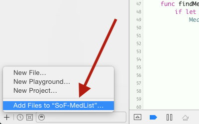

Swift-SMART is an iOS and OS X framework for building apps that interact with healthcare data through [**SMART on FHIR**](http://docs.smarthealthit.org).

Written in _Swift_ it is compatible with **iOS 8** and **OS X 10.9** and later and requires Xcode 6 or later.
You can target **iOS 7** by including all source files in your main project rather than using the embedded framework target.

We have a simple [medication list](https://github.com/smart-on-fhir/SoF-MedList) sample app so you can see how you use the framework.

The `master` branch is currently on FHIR _DSTU 1_.  
The `develop` branch is work in progress for FHIR _DSTU 2_.


Installation
------------

Currently the best way to obtain the framework is via `git`.

### Via git

Using Terminal.app, navigate to your project directory and execute:

    $ git clone --recursive https://github.com/smart-on-fhir/Swift-SMART

This will download the latest codebase and all dependencies of the _master_branch.
To use a different branch, e.g. the develop branch, add `-b develop` to the clone command or checkout the appropriate branch after cloning.
Once this process completes open your app project in Xcode and add `SwiftSMART.xcodeproj`:



Now link the framework to your app:


1. Make your App also build the framework
2. Link it
3. Embed the framework in your app (as of Xcode 6.2, this step happens in the "General" tab)


Using the Client
----------------

The framework's technical documentation is available from within Xcode (alt-click any class or property of the SMART framework) and on [docs.smarthealthit.org/Swift-SMART](http://docs.smarthealthit.org/Swift-SMART/).
Make sure to take a look at the [official SMART on FHIR documentation](http://docs.smarthealthit.org).

> **Note:** The SMART framework contains the [Swift-FHIR data models framework](https://github.com/smart-on-fhir/Swift-FHIR).
> These are compiled into the framework, you will only need to `import SMART` in your source files.

### Initializing the Client

Apps running against a SMART provider must be **registered** with the server.
If you are simply testing grounds you can use our sandbox server and the shared `my_mobile_app` client-id:

```Swift
import SMART

let smart = Client(
    baseURL: "https://fhir-api-dstu2.smarthealthit.org",
    settings: [
        "client_id": "my_mobile_app",
        "redirect": "smartapp://callback",      // must match registered redirect url
    ]
)
```

### Authorization

On FHIR servers requiring authorized access (such as SMART on FHIR servers) you must first have the user authorize your app.
The client's `authProperties` variable allows you to specify a few options for how you want to authorize.
The default settings use an embedded web view to have the user log in, and then displays a native patient selector.

```swift
smart.authProperties.embedded = true
smart.authProperties.granularity = .PatientSelectNative
smart.authorize() { patient, error in
    // check for error
    // `patient` is a "Patient" resource on success
}
```

You can also use the following to make sure the client is ready to execute requests:

```swift
smart.ready() { error in
    // do your work
}
```

### Using FHIR Resources

All basic FHIR profiles/resources have their own class.
To read a patient with a known id from your server you can use:

```swift
Patient.read({patient-id}, server: smart.server) { resource, error in
    // check error
    // `resource` is a "Patient" instance on success
}
```

To perform a search for all prescriptions of a known patient id you can use:

```swift
MedicationPrescription.search(["patient": id])
.perform(smart.server) { bundle, error in
    if nil != error {
        // there was an error
    }
    else {
        var meds = [MedicationPrescription]()
        if let entries = bundle?.entry {
            for entry in entries {
                if let med = entry.resource as? MedicationPrescription {
                    meds.append(med)
                }
            }
        }
        // now `meds` contains all prescription resources
    }
}
```
